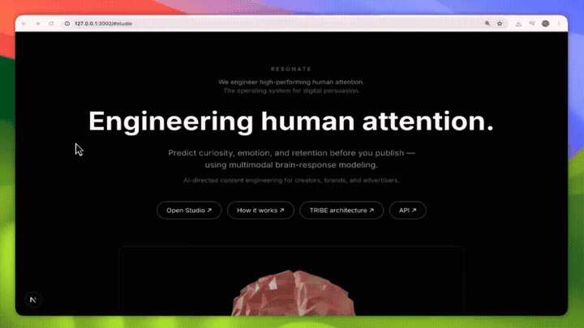

# Resonate

**See full-brain engagement before you publish.**

Resonate is a pre-publish studio for creators and brands. It uses **Meta’s TRIBE v2 model** — trained on **fMRI brain scans** of people watching video — to project **how the whole brain responds** to your clip over time: curiosity, emotion, and where attention fades.

Then it tells you **where to make changes in the video** — which moments to cut, re-pace, or re-script — so viewers stay through to **full engagement**.

Not likes after upload. **Brain-level signal before go-live.**

---

## Demo video

Plays **inline on GitHub** — no download required.

https://github.com/Nabilhassan12345/resonate/blob/main/public/videos/stimulus-a.mp4



---

## The problem

- Creators and media teams edit blind, then learn from views whether the video worked.
- A brand can spend millions on talent, production, and ads — and still lose reach when engagement dies at a specific second nobody caught in review.
- There is no simple pre-publish tool that says: *“At 0:11s, predicted cortical engagement drops — change this beat here.”*

---

## How it works

1. **TRIBE v2 (foundation)** — Predicts cortical activity from **video, audio, and language** together. Trained on **1,000+ hours of fMRI** from hundreds of people watching real stimuli. Benchmarked at **~70× finer resolution** than earlier brain models and **several-fold better** than standard baselines on new clips.
2. **Google Colab (this project)** — We ran TRIBE-style inference on creator clips to validate the pipeline.
3. **Resonate (product)** — Turns those brain projections into **actionable edit guidance** anyone can use in a browser.

> **Demo note:** The live app uses **simulated** TRIBE projections for the hackathon — same pipeline shape, no live model weights in production.

---

## What you get in the studio

| Output | What it tells you |
|--------|-------------------|
| **Full-brain engagement map** | 3D cortical heatmap over time — where the brain lights up and cools down (True vs Predicted) |
| **Attention & emotion curves** | Second-by-second predicted engagement across a 20s window |
| **Engagement index** | Overall strength of predicted brain response to your cut |
| **Drop-off timestamps** | Exact seconds where engagement is at risk — click to jump the player |
| **Edit suggestions** | Before/after lines and framing — tied to *why* that moment under-activates |

**That is the product:** not “we analyzed your video” — **we modeled brain response and pointed to the edits.**

---

## What to change in your video (examples)

Resonate surfaces **where** to adjust, not just **whether** the video is good:

- **Opening (0–3s)** — Strengthen curiosity before cortical engagement dips  
- **Mid-roll (e.g. 11s)** — Re-hook or cut flat narration where language-network engagement falls  
- **Pacing** — Shorten beats between peaks so reward-anticipation regions stay active  
- **Script** — Swap weak lines for versions predicted to re-activate attention regions  

Each suggestion links to a **timestamp** and a **brain region** (simulated ROI), so edits are specific.

---

## 60-second pitch (what to say)

> Brands and creators spend millions on video — actors, crews, ads — and still lose money when engagement breaks at one second they never fixed. They find out after it’s live.
>
> **Resonate uses TRIBE v2** — trained on **over a thousand hours of fMRI** while people watched real video — to predict **full-brain engagement** on **your** clip. **I ran it in Google Colab; this app is the product layer.**
>
> **Upload your video.** You see **where the brain responds**, **where it drops**, and **what to change** — cuts, pacing, script — **so people stay to full engagement.**
>
> **Pre-publish brain QA for creators and media teams.** **Resonate — engineer attention before you ship.**

---

## Run locally

```bash
git clone https://github.com/Nabilhassan12345/resonate.git
cd resonate
npm install
npm run dev
```

Open [http://localhost:3000](http://localhost:3000) → **Attention Studio** — the demo loads `public/videos/stimulus-a.mp4` automatically → click **Analyze**.

---

## Medipol Hackathon 2026

Cortical modeling inspired by **Meta TRIBE v2** (open source).

© 2026 Resonate
